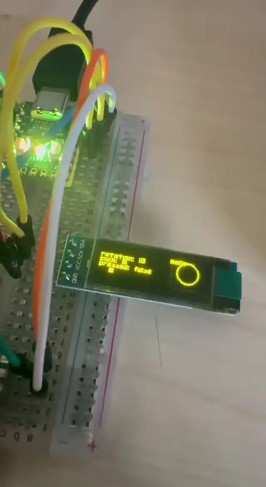

# RP2040 Zero TinyGo Test

A playground for testing device drivers and examples on RP2040 using TinyGo.



## What's included

- **Rotary encoder** with push switch
- **SSD1306 OLED** display
- **WS2812 RGB LED**

## Setup

### Prerequisites

- [TinyGo](https://tinygo.org/getting-started/)
- RP2040 board (Raspberry Pi Pico or compatible)
- USB cable

### Flash the project

```bash
tinygo flash -target=<board> -port=/dev/ttyACM0 ./
```

Replace `<board>` with your target (e.g., `pico`).

### Read the serial output

**Install picocom** (Linux):

```bash
sudo apt update && sudo apt install picocom
```

**Connect to console**:

```bash
picocom -b 115200 /dev/ttyACM0
```

Exit: `Ctrl-A Ctrl-X`

## Serial output

`main.go` writes a single updating status line to the serial console at 115200 baud:

```go
fmt.Fprintf(machine.Serial, "\r%-60s", line)
```

This overwrites the same line in-place. Use `fmt.Fprintln()` for new lines instead:

```go
fmt.Fprintln(machine.Serial, line)
```

To clear the line before printing:

```go
fmt.Fprintf(machine.Serial, "\r\033[K%s", line)
```

## Example: main.go

### Rotary encoder

- Reads via the `enc.Dir` channel (emits `+1` or `-1` per click)
- Maintains a position counter by accumulating direction values

```go
pos := 0
for {
    select {
    case dir := <-enc.Dir:
        pos += dir
    }
}
```

### Switch / button

- Polls the pin for press state (active-low with pull-up)
- Uses `enc.SwitchWasClicked()` to detect release (debounced)

### OLED display

- Renders text with `tinyfont` and shapes with `tinydraw`
- Updates each frame

### Colors

Color constants must be `var`, not `const` (composite literals):

```go
var WHITE = color.RGBA{255, 255, 255, 255}
```

## Files

- `main.go` — example application
- `go.mod` / `go.sum` — dependencies

## BOM
This is the bill of materials:
- [RP2040-zero](https://it.aliexpress.com/item/1005010768723373.html?spm=a2g0o.order_list.order_list_main.11.7fa33696r4LsTd&gatewayAdapt=glo2ita)
- [OLED](https://it.aliexpress.com/item/1005007672413060.html?spm=a2g0o.order_list.order_list_main.198.7fa33696r4LsTd&gatewayAdapt=glo2ita)
- [EC11](https://it.aliexpress.com/item/1005006127287538.html?spm=a2g0o.order_list.order_list_main.35.7fa33696r4LsTd&gatewayAdapt=glo2ita)

## License

This project is licensed under the MIT License. See the [LICENSE](LICENSE) file for details.
